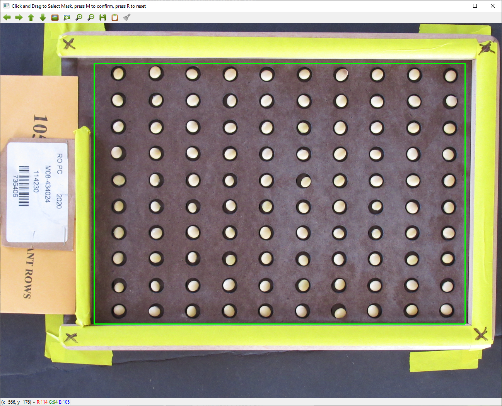
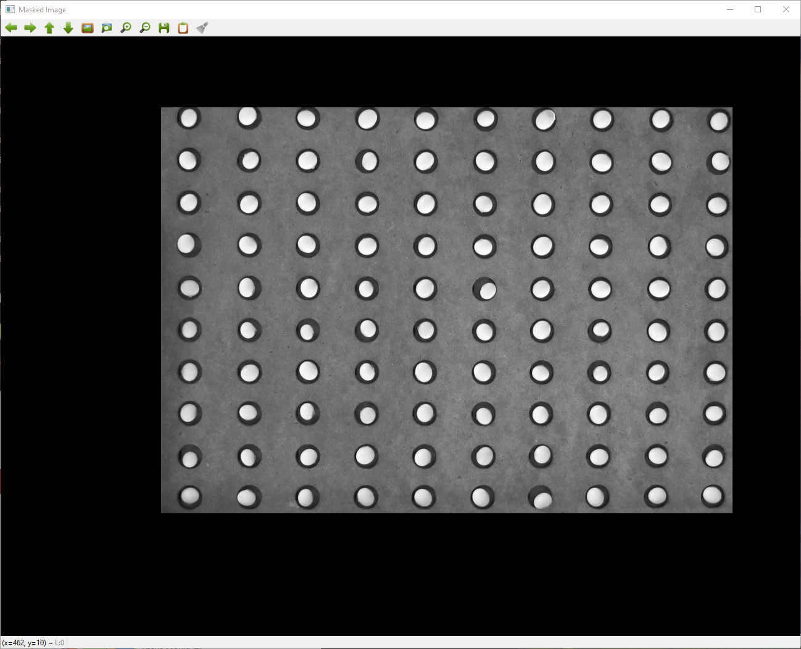

# BeanCounter
Image analysis for rapid phenotyping of soybeans. Developing under the UROP @ University of Minnesota

## Overview
This software is used to rapidly measure dimensions of seeds from images taken in an overhead camera rig.

## Inputs
Use python main_interactive_mask.py -inpath "YOUR_FOLDER" to set the input folder. In my use case, images were overhead shots of a seed-counting tray. This allows the beans to be placed approximately equidistant from each other.

## Outputs
A csv with filename, seed number, a calibration distance (farthest two seeds), surface area, perimeter, circularity, length, width, and aspect ratio.

## Usage
Set up an environment using anaconda. Run conda env create -f analysis.yml to make an environment named analysis.
Activate the analysis environment, then run main_interactive_mask.py -inpath "YOUR_FOLDER"

The images will load, then the first will be used to mask areas outside of the seed tray. 

After masking, use any key to move forward and review each image, or hold down to skip through the images. If imaged are not consitently framed, the mask may interfere with the seed shape description.
The program will output a 'results.csv' file with each seed of each image as a row. Files should be named in a way that identifies the accession in the image.
